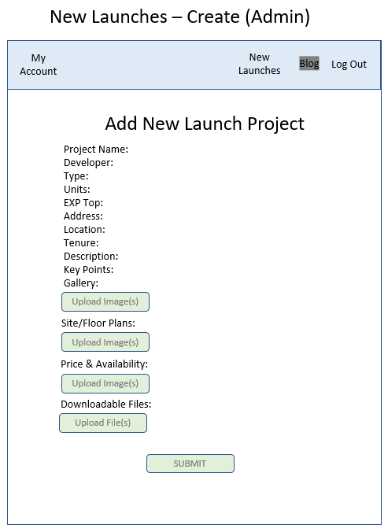
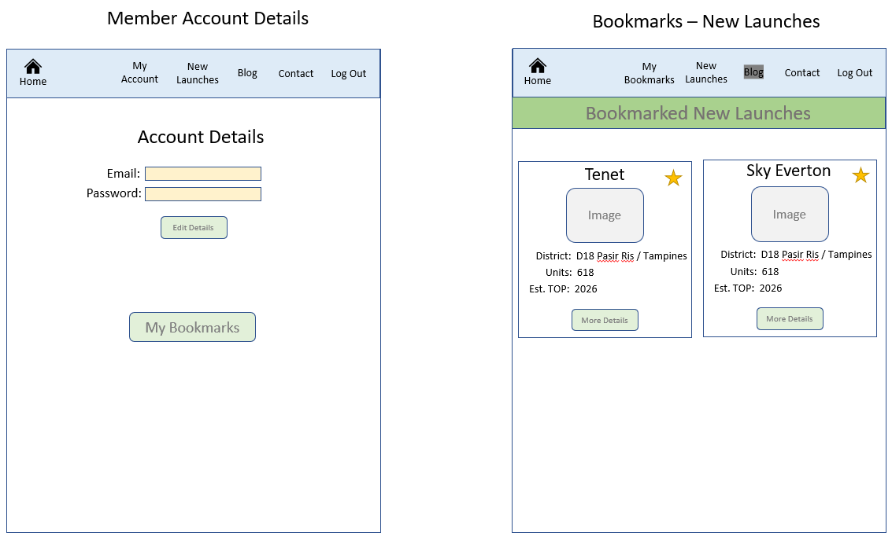

# Real Estate Site - Homes by Anna C

A web platform for a real estate agent persona named Anna Chong, it provides a space for agent personal branding to potential clients. Includes CRUD functionality for listings of new property developments and built on MERN stack with Typescript.

Explore the app at this Live URL:
[ Homes by Anna C ]("")

# Features

Public Role

- See real estate agent's profile on index page
- See all available New Launch listings and filter by district
- Click in to individual listings to see New Launch listing's details
- Sign up for a member account

Member Role

- Sign in to member account
- See real estate agent's profile on index page
- See all available New Launch listings and filter by district
- Bookmark/unbookmark specific listings on New Launch listings page
- Click in to individual listings to see New Launch listing's details
- Access "My Bookmarks" page which shows member's bookmarked listings with option to unbookmark
- Sign out of account

Admin Role

- Sign in to admin account
- See all available New Launch listings and filter by district
- Create new New Launch listing
- Click in to individual listings to see New Launch listing's details
- Edit individual listing's details
- Delete New Launch listings
- Sign out of account

# Technologies Used

- jwt-decode v.1.2
- react v18.2.0
- tailwindcss v3.3.1
- typescript v4.9.3
- vite - v4.2.0
- react-icons v4.8.0
- bcrypt v5.1.0
- multer" v1.4.5-lts.1
- uuid v9.0.0
- mongoose v7.0.3
- jsonwebtoken v9.0.0
- express v4.18.2
- dotenv v16.0.3
- bcrypt v5.1.0
- @aws-sdk/client-s3 v3.316.0

## Timeline for Project

6 Working Days

# ERD Models

There are 3 model schemas created for this project, all using model referencing. NewLaunch as the main model, and the other 2 are user models Admin and Member.

# Wireframe

Below are some of the basic wireframes I did up before starting on the project.

- Public Logged Out Pages

- Admin Pages

- Member Sign Up Page

- Member Logged In Pages

# App Screenshots

Logged Out Main Page:

Member Main Page:

Public New Launches Page:

Members New Launches Page:

Members Bookmark Page:

Members New Launch Details Page:

Members New Launch Details Page (continued):

Admin New Launches Page:

Admin New Launch Details Page:

Admin Edit New Launch Page:

# Future Developments

- Implement a more advanced search function
- Have a more advanced contact me form on Contact page, with message sending to agent's email address
- Possibly another entire CRUD function feature of "Blog" on the site, with articles and comments function
